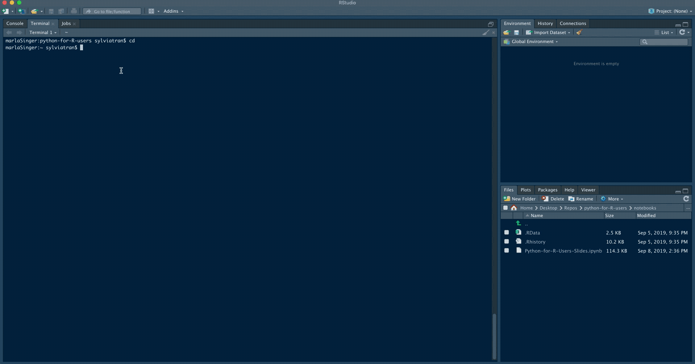

# python-for-R-users
This repository is intended for a high level overview of python for R users, data cleaning, preprocessing, modeling.
The modeling is only for demonstrative purposes (and not to demonstrate how to optimize hyperparameters or minimize loss).

